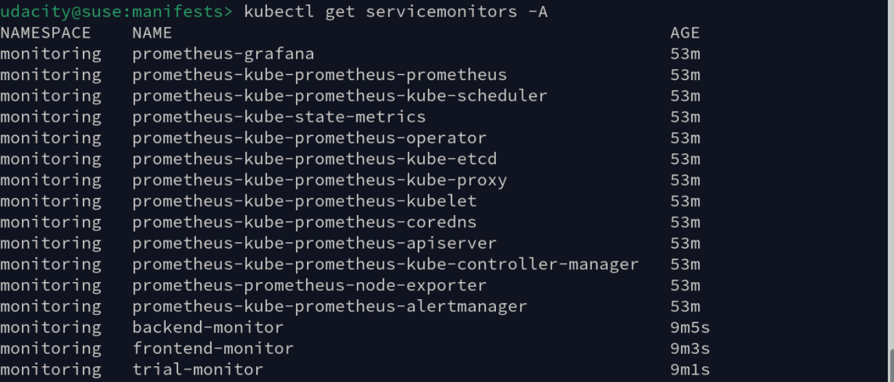

**Note:** For the screenshots, you can store all of your answer images in the `answer-img` directory.

## Verify the monitoring installation

*TODO:* run `kubectl` command to show the running pods and services for all components. Take a screenshot of the output and include it here to verify the installation  
Pods and services running in monitoring namespace:
 
 
Pods and services running in observability namespace:
 
 
Pods and services running in default namespace:
 
 
List of service monitors:
 

## Setup the Jaeger and Prometheus source
*TODO:* Expose Grafana to the internet and then setup Prometheus as a data source. Provide a screenshot of the home page after logging into Grafana.  
 
 

## Create a Basic Dashboard
*TODO:* Create a dashboard in Grafana that shows Prometheus as a source. Take a screenshot and include it here.  
  
The above dashboard is stored in the `dashboards` directory: Basic Dashboard.json

## Describe SLO/SLI
*TODO:* Describe, in your own words, what the SLIs are, based on an SLO of *monthly uptime* and *request response time*.  
Service Level Indicators (SLIs) and Service Level Objectives (SLOs) are essential components used to measure and ensure the quality of service delivery. An SLI is a metric that measures specific attributes of the service such as performance and reliability against defined Service Level Objectives (SLOs). An SLO is the target value that an organization aims to achieve for a given SLI. It defines the acceptable thresholds of these metrics. In the context of SLOs that focus on monthly uptime and request response time, two SLIs that provide insight into how well a service is performing might be:

Monthly Uptime: This SLI measures the percentage of time that the service is operational and accessible to users within a month. For instance, if the agreed uptime is 99.5%, the service should be available and functioning correctly 99.5% of the time within any given month.

Request Response Time: This SLI measures the time taken to respond to a user request. It indicates the speed and efficiency of handling requests. For example, if the response time objective is set to 200 milliseconds, the service should respond to user requests within 200 milliseconds on average and the SLI would track the percentage of requests that meet this criterion.

## Creating SLI metrics.
*TODO:* It is important to know why we want to measure certain metrics for our customer. Describe in detail 5 metrics to measure these SLIs.   
1. Monthly Uptime Percentage  
This metric measures the percentage of time that the service is operational and available to users over a month. High uptime is critical for user satisfaction and trust. Customers expect services to be available consistently, and this metric directly reflects the reliability of the service.

2. Average Request Response Time  
This metric measures the average time taken for the service to respond to requests over a specified period (e.g., monthly). A low average response time indicates that the service is performing well and providing a good user experience. Customers are likely to abandon services that respond slowly.

3. 95th Percentile Response Time  
This metric measures the response time below which 95% of the requests fall. It helps to understand the upper limit of response times experienced by most users and highlights the worst-case scenarios. Even if the average response time is acceptable, a high 95th percentile response time can indicate that some users are experiencing significant delays.

4. Error Rate  
This metric measures the percentage of requests that result in errors (e.g., HTTP 4xx and 5xx status codes) over a specified period. A low error rate is essential for maintaining user trust and satisfaction. High error rates can indicate underlying issues with the service that need to be addressed.

5. Time to Repair (TTR)  
This metric indicates the period from receiving an incident message until the basic functionality is restored and the customer is informed.

## Create a Dashboard to measure our SLIs
*TODO:* Create a dashboard to measure the uptime of the frontend and backend services We will also want to measure 40x and 50x errors. Create a dashboard that shows these values over a 24 hour period and take a screenshot.  

  
The above dashboard is stored in the `dashboards` directory: Prometheus Dashboard.json

## Tracing our Flask App
*TODO:*  We will create a Jaeger span to measure the processes on the backend. Once you fill in the span, provide a screenshot of it here. Also provide a (screenshot) sample Python file containing a trace and span code used to perform Jaeger traces on the backend service.

## Jaeger in Dashboards
*TODO:* Now that the trace is running, let's add the metric to our current Grafana dashboard. Once this is completed, provide a screenshot of it here.

## Report Error
*TODO:* Using the template below, write a trouble ticket for the developers, to explain the errors that you are seeing (400, 500, latency) and to let them know the file that is causing the issue also include a screenshot of the tracer span to demonstrate how we can use a tracer to locate errors easily.

TROUBLE TICKET

Name: Trial App Issue

Date: August 26 2025, 09:04:48

Subject: Operation get-python-jobs fails. The provided jobs endpoint is unreachable.

Affected Area: Python script `reference-app/trial/app.py`.

Severity: High

Description: Connection refused error. As shown by the tracer span in the screenshot below, the trial application failed to establish a connection to url 'https://jobs.github.com/positions.json?description=python'.
  
  

## Creating SLIs and SLOs
*TODO:* We want to create an SLO guaranteeing that our application has a 99.95% uptime per month. Name four SLIs that you would use to measure the success of this SLO.

## Building KPIs for our plan
*TODO*: Now that we have our SLIs and SLOs, create a list of 2-3 KPIs to accurately measure these metrics as well as a description of why those KPIs were chosen. We will make a dashboard for this, but first write them down here.

## Final Dashboard
*TODO*: Create a Dashboard containing graphs that capture all the metrics of your KPIs and adequately representing your SLIs and SLOs. Include a screenshot of the dashboard here, and write a text description of what graphs are represented in the dashboard.  
